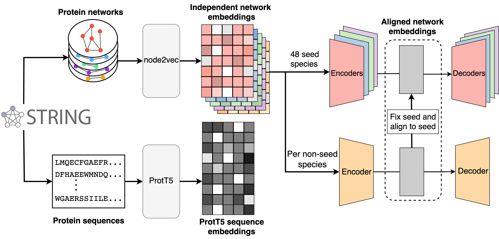

# SPACE: STRING proteins as complementary embeddings
Code for the manuscript: "SPACE: STRING proteins as complementary embeddings"
add link here. 

The precalculated embeddings can be downloaded directly from [the STRING website](https://string-db.org/)



# How to read the embedding files

Install the `h5py` package to read the single species embedding files. The following code reads the embedding file `xxx.h5` of a single species.

In Python: 
```bash
pip install h5py
```


```Python
import h5py

filename = 'xxx.h5'

with h5py.File(filename, 'r') as f:
    meta_keys = f['metadata'].attrs.keys()
    for key in meta_keys:
        print(key, f['metadata'].attrs[key])

  embedding = f['embeddings'][:]
  proteins = f['proteins'][:]

  # protein names are stored as bytes, convert them to strings
  proteins = [p.decode('utf-8') for p in proteins]
```

In R:  
Install the `rhdf5` package to read the embedding files. The following code reads the embedding file `xxx.h5`.

```R
# Install required packages if not already installed
# install.packages("rhdf5")

# Load the library
library(rhdf5)

filename <- 'xxx.h5'

metadata <- h5readAttributes(filename, "metadata")
for (key in names(meta_keys)) {
    print(paste(key, meta_keys[[key]]))
}

embeddings <- h5read(filename, "embeddings")
proteins <- h5read(filename, "proteins")
```

Read the combined file with Python
```Python
import h5py

filename = 'xxx.h5'

with h5py.File(filename, 'r') as f:
    meta_keys = f['metadata'].attrs.keys()
    for key in meta_keys:
        print(key, f['metadata'].attrs[key])
  
  species = '4932'  # if we check the brewer's yeast
  embeddings = f['species'][species]['embeddings'][:]
  proteins = f['proteins'][species]['embeddings'][:]

  # protein names are stored as bytes, convert them to strings
  proteins = [p.decode('utf-8') for p in proteins]

```
Read the combined file with R
```R
library(rhdf5)

filename <- 'xxx.h5'

meta_keys <- h5attributes(h5file$metadata)
for (key in names(meta_keys)) {
    print(paste(key, meta_keys[[key]]))
}

species <- '4932'  # for brewer's yeast
embeddings <- h5read(filename, paste0('species/', species, '/embeddings'))
proteins <- h5read(filename, paste0('species/', species, '/proteins'))
```


## Key Features
- **Complementary embeddings**: SPACE provides embeddings for each eukaryotic protein in the STRING network, which is complementary to the sequence-based embeddings.
- **Maintenance of original node2vec information**: Aligned embeddings are comparable to the original node2vec embeddings, benchmarked against the KEGG pathways.
- **Improved performance**: SPACE embeddings can improve cross-species predictions such as subcellular localization and protein function prediction.


# To reproduce the results

## Installation
```bash
git clone https://github.com/deweihu96/SPACE.git
conda create -n space python=3.11
conda activate space
cd SPACE
pip install .
```


## Download Data

A processed version of all the files to reproduce can be downloaded from here: xxxxxx.

For your convenience and to save the time to get the meaningful reproductions, we include these files:
- `data/orthologs`: preprocessed orthologs pairs
- `data/node2vec`: precalculated node2vec embeddings for all euakryotic proteins in STRING network (v12.0) 
- `data/aligned`: precalculated aligned embeddings for all euakryotic proteins in STRING network (v12.0)
-

## Run node2vec embeddings
```bash
## change the species_id to the species you want to run
mkdir -p results/node2vec

# with default hyperparameters
python scripts/node2vec.py \
-i data/networks/{species_id}.protein.links.v12.0.txt.gz \
-o results/node2vec

```
You can skip this step and use the embeddings we provided here: xxxxxxxx

## Seed species alignment
```bash
python scripts/align_seeds.py
```

## Non-seed species alignment
```bash
# align rat to the 48 seed species
python scripts/align_non_seeds.py \
--non_seed_species 10116
```
## License
MIT.