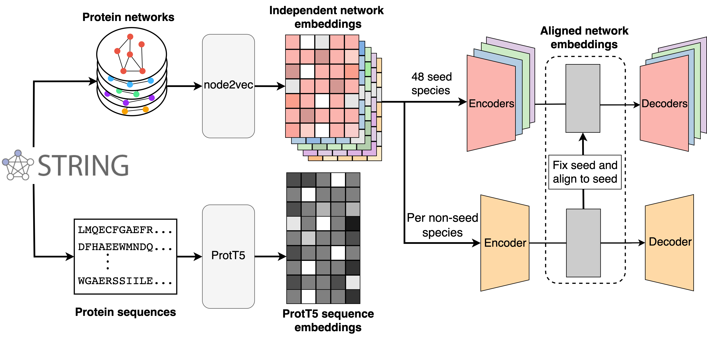

# SPACE: STRING proteins as complementary embeddings

## Table of Contents
- [Introduction](#introduction)
- [Reproduce the Results](#reproduce-the-results-in-the-paper)
- [How to Cite](#how-to-cite)
- [How to load the embeddings](#how-to-load-the-embeddings)
    - [Python Example](#python-example)
    - [R Example](#r-example)
    - [Read Combined Files](#read-combined-files)
- [Contact](#contact)
- [Star History](#star-history)
- [License](#license)

## Introduction
Official repository for the paper in **Bioinformatics**: [SPACE: STRING proteins as complementary embeddings](https://doi.org/10.1093/bioinformatics/btaf496),
in which we precalculated:
- cross-species network embeddings 
- ProtT5 sequence embeddings  

for all eukaryotic proteins in STRING v12.0.

You can [download all the embeddings from the STRING website](https://string-db.org/cgi/download):
- protein.network.embeddings.v12.0.h5
- protein.sequence.embeddings.v12.0.h5



## Reproduce the results in the paper
Please follow this [document](./reproduce.md).

## How to Cite
If you use this work in your research, please cite **the SPACE paper**:  

Hu, Dewei, et al. "SPACE: STRING proteins as complementary embeddings." Bioinformatics (2025): btaf496. [https://doi.org/10.1101/2024.11.25.625140](https://doi.org/10.1093/bioinformatics/btaf496)

and **the STRING database**: 

Szklarczyk, D., Nastou, K., Koutrouli, M., Kirsch, R., Mehryary, F., Hachilif, R., ... & von Mering, C. (2025). The STRING database in 2025: protein networks with directionality of regulation. Nucleic Acids Research, 53(D1), D730-D737. [https://doi.org/10.1093/nar/gkae1113](https://doi.org/10.1093/nar/gkae1113)

## How to load the embeddings

The following code reads the cross-species network embedding file `9606.protein.network.embeddings.v12.0.h5`. 

#### Python example 
```bash
pip install h5py
```

```Python
import h5py

filename = '9606.protein.network.embeddings.v12.0.h5'

with h5py.File(filename, 'r') as f:
    meta_keys = f['metadata'].attrs.keys()
    for key in meta_keys:
        print(key, f['metadata'].attrs[key])

    embedding = f['embeddings'][:]
    proteins = f['proteins'][:]
	
    # protein names are stored as bytes, convert them to strings
    proteins = [p.decode('utf-8') for p in proteins]
```

#### R example:  
Install the `rhdf5` package to read the embedding files. The following code reads the embedding file `9606.protein.network.embeddings.v12.0.h5`.

```R
# Install required packages if not already installed
# install.packages("rhdf5")

# Load the library
library(rhdf5)

filename <- '9606.protein.network.embeddings.v12.0.h5'

metadata <- h5readAttributes(filename, "metadata")
for (key in names(meta_keys)) {
    print(paste(key, meta_keys[[key]]))
}

embeddings <- h5read(filename, "embeddings")
proteins <- h5read(filename, "proteins")
```
#### Read combined files
Read the combined network embedding file of all eukaryotes  with Python
```Python
import h5py

filename = 'protein.network.embeddings.v12.0.h5'

with h5py.File(filename, 'r') as f:
    meta_keys = f['metadata'].attrs.keys()
    for key in meta_keys:
        print(key, f['metadata'].attrs[key])
  
    species = '4932'  # if we check the brewer's yeast
    embeddings = f['species'][species]['embeddings'][:]
    proteins = f['species'][species]['proteins'][:]
	
    # protein names are stored as bytes, convert them to strings
    proteins = [p.decode('utf-8') for p in proteins]

```
Read the combined file with R
```R
library(rhdf5)

filename <- 'protein.network.embeddings.v12.0.h5'

meta_keys <- h5attributes(h5file$metadata)
for (key in names(meta_keys)) {
    print(paste(key, meta_keys[[key]]))
}

species <- '4932'  # for brewer's yeast
embeddings <- h5read(filename, paste0('species/', species, '/embeddings'))
proteins <- h5read(filename, paste0('species/', species, '/proteins'))
```

## Contact
[dewei.hu@sund.ku.dk](dewei.hu@sund.ku.dk).

## Star history
[](https://www.star-history.com/#deweihu96/SPACE&Date)

## License
MIT.
